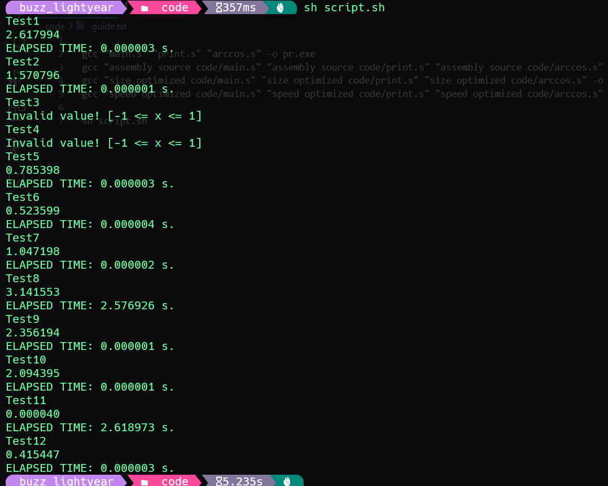
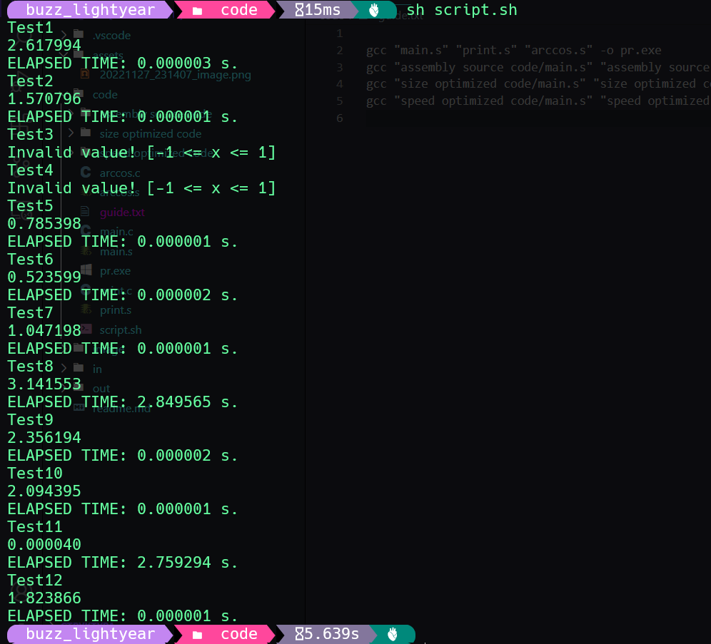

# 1. Сафаров Сардор Хайрулла угли

# 2. БПИ212

# 3. Вариант №8. Разработать программу, вычисляющую с помощью степенного ряда с точностью не хуже 0,1% значение функции arccos(x) для задан- ного параметра x.

# 4. Тесты, демонстрирующие проверку программ.

### Тесты находятся в папке "../in"

### Для запуска скрипта для тестов

```shell
sh script.sh
```

# 5.Результаты тестовых прогонов для различных исходных данных.

### Результаты тестирование программы, полученной из отредактированного ассемблерного кода:



### Результаты тестирование программы, полученной напрямую из си кода:




# 6. Исходные тексты программы на языке C.

```C
#include <stdio.h>
#include <stdlib.h>
#include <stdbool.h>
#include <getopt.h>
#include <time.h>

extern double ArcCos(double x);
extern void PrintResult(char *outName, double res, clock_t diff);
extern void PrintError(char *mess, char *outName);

int main(int argc, char *argv[])
{
    char *inName = NULL, *outName = NULL;
    int com = 0;
    bool isRand = false;
    while ((com = getopt(argc, argv, "i:o:g")) != -1)
    {
        if (com == 'g')
        {
            isRand = true;
        }
        else if (com == 'i')
        {
            inName = optarg;
        }
        else if (com == 'o')
        {
            outName = optarg;
        }
        else
        {
            PrintError("The option is not correct!", "../out/out.txt");
            return 0;
        }
    }

    if (isRand)
    {
        srand(time(NULL));
        double x = (double)rand() / RAND_MAX * 2.0 - 1.0;
        clock_t start = clock();
        double res = ArcCos(x);
        clock_t end = clock();
        PrintResult(outName, res, end - start);
    }
    else
    {
        FILE *in = fopen(inName, "r");
        if (in == NULL)
        {
            PrintError("Input file does not exist!", outName);
            return 0;
        }
        double x = 0;
        fscanf(in, "%lf", &x);
        fclose(in);
        if (x < -1 || x > 1)
        {
            PrintError("Invalid value! [-1 <= x <= 1]", outName);
            return 0;
        }
        clock_t start = clock();
        double res = ArcCos(x);
        clock_t end = clock();
        PrintResult(outName, res, end - start);
    }

    return 0;
}
```

```C
#include <math.h>
double ArcCos(double x)
{
    int n = 0;
    double res = 0;
    double y = x * x;
    do
    {
        res += x;
        x = x * y * (n + 0.5) / (n + 1) * (n + 0.5) / (n + 1.5);
        ++n;
    } while (fabs(x) > 0.0000000000001);
    return M_PI_2 - res;
}
```

```C
#include <stdio.h>
#include <time.h>
void PrintResult(char *outName, double res, clock_t diff)
{
    FILE *out = fopen(outName, "w");
    fprintf(out, "%lf\nELAPSED TIME: %lf s.\n", res, (double)(diff) / CLOCKS_PER_SEC);
    fclose(out);
}
void PrintError(char *mess, char *outName)
{
    FILE *out = fopen(outName, "w");
    fprintf(out, "%s\n", mess);
    fclose(out);
}
```

# 7. Тексты программы на языке ассемблера, разработанной вручную или полученной после компиляции и расширенной комментариями.

```assembly
	.file	"main.c"
	.intel_syntax noprefix
	.text
	.section	.rodata
.LC0:
	.string	"../out/out.txt"
.LC1:
	.string	"The option is not correct!"
.LC2:
	.string	"i:o:g"
.LC5:
	.string	"r"
.LC6:
	.string	"Input file does not exist!"
.LC8:
	.string	"%lf"
.LC10:
	.string	"Invalid value! [-1 <= x <= 1]"
	.text
	.globl	main
	.type	main, @function
main:
	endbr64
	push	rbp								# стандартный пролог
	mov		rbp, rsp						# стандартный пролог
	sub		rsp, 112
	mov		DWORD PTR -100[rbp], edi
	mov		QWORD PTR -112[rbp], rsi
	mov		QWORD PTR -8[rbp], 0			# char *inName = NULL;
	mov		QWORD PTR -16[rbp], 0			# char *outName = NULL;
	mov		DWORD PTR -24[rbp], 0			# int com = 0;
	mov		BYTE PTR -17[rbp], 0			# bool isRand = false;
	jmp		.L2								# while
.L7:
	cmp		DWORD PTR -24[rbp], 103			# if (com == 'g')
	jne		.L3
	mov		BYTE PTR -17[rbp], 1			# isRand = true;
	jmp		.L2
.L3:
	cmp		DWORD PTR -24[rbp], 105			# else if (com == 'i')
	jne		.L4
	mov		rax, QWORD PTR optarg[rip]
	mov		QWORD PTR -8[rbp], rax			# inName = optarg;
	jmp		.L2
.L4:
	cmp		DWORD PTR -24[rbp], 111			# else if (com == 'o')
	jne		.L5
	mov		rax, QWORD PTR optarg[rip]
	mov		QWORD PTR -16[rbp], rax			# outName = optarg;
	jmp		.L2
.L5:
	lea		rsi, .LC0[rip]
	lea		rdi, .LC1[rip]
	call	PrintError@PLT					# PrintError("The option is not correct!", "output.txt");
	mov		eax, 0
	jmp		.L6								# return 0;
.L2:
	mov		rcx, QWORD PTR -112[rbp]
	mov		eax, DWORD PTR -100[rbp]
	lea		rdx, .LC2[rip]
	mov		rsi, rcx
	mov		edi, eax
	call	getopt@PLT
	mov		DWORD PTR -24[rbp], eax
	cmp		DWORD PTR -24[rbp], -1			# while ((com = getopt(argc, argv, "i:o:g")) != -1)
	jne		.L7
	cmp		BYTE PTR -17[rbp], 0			# if (isRand)
	je		.L8
	mov		edi, 0
	call	time@PLT						# time(NULL);
	mov		edi, eax
	call	srand@PLT						# srand(time(NULL));
	call	rand@PLT						# rand();
	cvtsi2sd	xmm0, eax
	movsd	xmm1, QWORD PTR .LC3[rip]
	divsd	xmm0, xmm1
	addsd	xmm0, xmm0
	movsd	xmm1, QWORD PTR .LC4[rip]
	subsd	xmm0, xmm1
	movsd	QWORD PTR -64[rbp], xmm0		# double x = (double)rand() / RAND_MAX * 2.0 - 1.0;
	call	clock@PLT
	mov		QWORD PTR -72[rbp], rax			# clock_t start = clock();
	mov		rax, QWORD PTR -64[rbp]
	movq	xmm0, rax
	call	ArcCos@PLT
	movq	rax, xmm0
	mov		QWORD PTR -80[rbp], rax			# double res = ArcCos(x);
	call	clock@PLT
	mov		QWORD PTR -88[rbp], rax			# clock_t end = clock();
	mov		rax, QWORD PTR -88[rbp]
	sub		rax, QWORD PTR -72[rbp]
	mov		rcx, rax
	mov		rdx, QWORD PTR -80[rbp]
	mov		rax, QWORD PTR -16[rbp]
	mov		rsi, rcx
	movq	xmm0, rdx
	mov		rdi, rax
	call	PrintResult@PLT					# PrintResult(outName, result, end - start);
	jmp		.L9								# goto line №68, return 0;
.L8:
	mov		rax, QWORD PTR -8[rbp]
	lea		rsi, .LC5[rip]
	mov		rdi, rax
	call	fopen@PLT
	mov		QWORD PTR -32[rbp], rax			# FILE *in = fopen(inName, "r");
	cmp		QWORD PTR -32[rbp], 0			# if (in == NULL)
	jne		.L10
	mov		rax, QWORD PTR -16[rbp]
	mov		rsi, rax
	lea		rdi, .LC6[rip]
	call	PrintError@PLT					# PrintError("Input file does not exist!", outName);
	mov		eax, 0
	jmp		.L6								# return 0;
.L10:
	pxor	xmm0, xmm0
	movsd	QWORD PTR -96[rbp], xmm0		# double x = 0;
	lea		rdx, -96[rbp]
	mov		rax, QWORD PTR -32[rbp]
	lea		rsi, .LC8[rip]
	mov		rdi, rax
	mov		eax, 0
	call	__isoc99_fscanf@PLT				# fscanf(in, "%lf", &x);
	mov		rax, QWORD PTR -32[rbp]
	mov		rdi, rax
	call	fclose@PLT						# fclose(in);
	movsd	xmm1, QWORD PTR -96[rbp]
	movsd	xmm0, QWORD PTR .LC9[rip]
	comisd	xmm0, xmm1
	ja		.L12
	movsd	xmm0, QWORD PTR -96[rbp]
	movsd	xmm1, QWORD PTR .LC4[rip]
	comisd	xmm0, xmm1
	jbe		.L15							# if (x < -1 || x > 1)
.L12:
	mov		rax, QWORD PTR -16[rbp]
	mov		rsi, rax
	lea		rdi, .LC10[rip]
	call	PrintError@PLT					# PrintError("Invalid value! [-1 <= x <= 1]", outName);
	mov		eax, 0
	jmp		.L6								# return 0;
.L15:
	call	clock@PLT
	mov		QWORD PTR -40[rbp], rax			# clock_t start = clock();
	mov		rax, QWORD PTR -96[rbp]
	movq	xmm0, rax
	call	ArcCos@PLT
	movq	rax, xmm0
	mov		QWORD PTR -48[rbp], rax			# double res = ArcCos(x);
	call	clock@PLT
	mov		QWORD PTR -56[rbp], rax			# clock_t end = clock();
	mov		rax, QWORD PTR -56[rbp]
	sub		rax, QWORD PTR -40[rbp]
	mov		rcx, rax
	mov		rdx, QWORD PTR -48[rbp]
	mov		rax, QWORD PTR -16[rbp]
	mov		rsi, rcx
	movq	xmm0, rdx
	mov		rdi, rax
	call	PrintResult@PLT					# PrintResult(outName, res, end - start);
.L9:
	mov		eax, 0							# return 0;
.L6:
	leave									# стандартный эпилог
	ret										# 
	.size	main, .-main
	.section	.rodata
	.align 8
.LC3:
	.long	4290772992
	.long	1105199103
	.align 8
.LC4:
	.long	0
	.long	1072693248
	.align 8
.LC9:
	.long	0
	.long	-1074790400

```

```assembly
	.file	"arccos.c"
	.intel_syntax noprefix
	.text
	.globl	ArcCos
	.type	ArcCos, @function
ArcCos:
	endbr64
	push	rbp							# стандартный пролог
	mov	rbp, rsp						# стандартный пролог
	movsd	QWORD PTR -40[rbp], xmm0	# double x
	mov	DWORD PTR -4[rbp], 0			# int n = 0;
	pxor	xmm0, xmm0
	movsd	QWORD PTR -16[rbp], xmm0	# double res = 0;
	movsd	xmm0, QWORD PTR -40[rbp]
	mulsd	xmm0, xmm0
	movsd	QWORD PTR -24[rbp], xmm0	# double y = x * x;
.L2:									# do
	movsd	xmm0, QWORD PTR -16[rbp]
	addsd	xmm0, QWORD PTR -40[rbp]
	movsd	QWORD PTR -16[rbp], xmm0	# res += x;
	movsd	xmm0, QWORD PTR -40[rbp]
	movapd	xmm1, xmm0
	mulsd	xmm1, QWORD PTR -24[rbp]	# x * y
	cvtsi2sd	xmm2, DWORD PTR -4[rbp]
	movsd	xmm0, QWORD PTR .LC1[rip]
	addsd	xmm0, xmm2					# n + 0.5
	mulsd	xmm0, xmm1					# x * y * (n + 0.5)
	mov	eax, DWORD PTR -4[rbp]
	add	eax, 1							# n + 1
	cvtsi2sd	xmm1, eax
	divsd	xmm0, xmm1					# x * y * (n + 0.5) / (n + 1)
	movapd	xmm1, xmm0
	cvtsi2sd	xmm2, DWORD PTR -4[rbp]
	movsd	xmm0, QWORD PTR .LC1[rip]
	addsd	xmm0, xmm2					# n + 0.5
	mulsd	xmm0, xmm1					# x * y * (n + 0.5) / (n + 1) * (n + 0.5)
	cvtsi2sd	xmm2, DWORD PTR -4[rbp]
	movsd	xmm1, QWORD PTR .LC2[rip]
	addsd	xmm1, xmm2					# n + 1.5
	divsd	xmm0, xmm1					# x * y * (n + 0.5) / (n + 1) * (n + 0.5) / (n + 1.5);
	movsd	QWORD PTR -40[rbp], xmm0	# x = x * y * (n + 0.5) / (n + 1) * (n + 0.5) / (n + 1.5);
	add	DWORD PTR -4[rbp], 1			# ++n;
	movsd	xmm0, QWORD PTR -40[rbp]
	movq	xmm1, QWORD PTR .LC3[rip]
	andpd	xmm0, xmm1
	comisd	xmm0, QWORD PTR .LC4[rip]	# while (fabs(x) > 0.0000000000001);
	ja	.L2								# goto do
	movsd	xmm0, QWORD PTR .LC5[rip]
	subsd	xmm0, QWORD PTR -16[rbp]
	pop	rbp								# стандартный эпилог
	ret									# возврат результата в eax
	.size	ArcCos, .-ArcCos
	.section	.rodata
	.align 8
.LC1:
	.long	0
	.long	1071644672
	.align 8
.LC2:
	.long	0
	.long	1073217536
	.align 16
.LC3:
	.long	4294967295
	.long	2147483647
	.long	0
	.long	0
	.align 8
.LC4:
	.long	1749644930
	.long	1027352002
	.align 8
.LC5:
	.long	1413754136
	.long	1073291771

```

```assembly
	.file	"print.c"
	.intel_syntax noprefix
	.text
	.section	.rodata
.LC0:
	.string	"w"
.LC2:
	.string	"%lf\nELAPSED TIME: %lf s.\n"
	.text
	.globl	PrintResult
	.type	PrintResult, @function
PrintResult:
	endbr64
	push	rbp								# стандартный пролог
	mov		rbp, rsp						# стандартный пролог
	sub		rsp, 48
	mov		QWORD PTR -24[rbp], rdi			# char *outName;
	movsd	QWORD PTR -32[rbp], xmm0		# double res;
	mov		QWORD PTR -40[rbp], rsi			# clock_t diff
	mov		rax, QWORD PTR -24[rbp]
	lea		rsi, .LC0[rip]
	mov		rdi, rax
	call	fopen@PLT
	mov		QWORD PTR -8[rbp], rax			# FILE *out = fopen(outName, "w");
	cvtsi2sd	xmm0, QWORD PTR -40[rbp]
	movsd	xmm1, QWORD PTR .LC1[rip]
	divsd	xmm0, xmm1
	mov		rdx, QWORD PTR -32[rbp]
	mov		rax, QWORD PTR -8[rbp]
	movapd	xmm1, xmm0
	movq	xmm0, rdx
	lea		rsi, .LC2[rip]
	mov		rdi, rax
	mov		eax, 2
	call	fprintf@PLT						# fprintf(out, "%lf\nELAPSED TIME: %lf s.\n", res, (double)(diff) / CLOCKS_PER_SEC);
	mov		rax, QWORD PTR -8[rbp]
	mov		rdi, rax
	call	fclose@PLT						# fclose(out);
	nop
	leave									# стандартный эпилог
	ret										# возврат из функции, в eax
	.size	PrintResult, .-PrintResult
	.section	.rodata
.LC3:
	.string	"%s\n"
	.text
	.globl	PrintError
	.type	PrintError, @function
PrintError:
	endbr64
	push	rbp								# стандартный пролог
	mov		rbp, rsp						# стандартный пролог
	sub		rsp, 32
	mov		QWORD PTR -24[rbp], rdi			# char *mess;
	mov		QWORD PTR -32[rbp], rsi			# char *outName;
	mov		rax, QWORD PTR -32[rbp]
	lea		rsi, .LC0[rip]
	mov		rdi, rax
	call	fopen@PLT						# fopen(outName, "w");
	mov		QWORD PTR -8[rbp], rax			# FILE *out = fopen(outName, "w");
	mov		rdx, QWORD PTR -24[rbp]
	mov		rax, QWORD PTR -8[rbp]
	lea		rsi, .LC3[rip]
	mov		rdi, rax
	mov		eax, 0
	call	fprintf@PLT						# fprintf(out, "%s\n", mess);
	mov		rax, QWORD PTR -8[rbp]
	mov		rdi, rax
	call	fclose@PLT						# fclose(out);
	nop
	leave									# стандартный эпилог
	ret										# возврат из функции, в eax
	.size	PrintError, .-PrintError
	.section	.rodata
	.align 8
.LC1:
	.long	0
	.long	1093567616

```

# 8. Текст на ассемблере программы, полученный после компиляции программы на C.

```assembly
	.file	"main.c"
	.text
	.section	.rodata
.LC0:
	.string	"../out/out.txt"
.LC1:
	.string	"The option is not correct!"
.LC2:
	.string	"i:o:g"
.LC5:
	.string	"r"
.LC6:
	.string	"Input file does not exist!"
.LC8:
	.string	"%lf"
.LC10:
	.string	"Invalid value! [-1 <= x <= 1]"
	.text
	.globl	main
	.type	main, @function
main:
.LFB6:
	.cfi_startproc
	endbr64
	pushq	%rbp
	.cfi_def_cfa_offset 16
	.cfi_offset 6, -16
	movq	%rsp, %rbp
	.cfi_def_cfa_register 6
	addq	$-128, %rsp
	movl	%edi, -116(%rbp)
	movq	%rsi, -128(%rbp)
	movq	%fs:40, %rax
	movq	%rax, -8(%rbp)
	xorl	%eax, %eax
	movq	$0, -88(%rbp)
	movq	$0, -80(%rbp)
	movl	$0, -100(%rbp)
	movb	$0, -101(%rbp)
	jmp	.L2
.L7:
	cmpl	$103, -100(%rbp)
	jne	.L3
	movb	$1, -101(%rbp)
	jmp	.L2
.L3:
	cmpl	$105, -100(%rbp)
	jne	.L4
	movq	optarg(%rip), %rax
	movq	%rax, -88(%rbp)
	jmp	.L2
.L4:
	cmpl	$111, -100(%rbp)
	jne	.L5
	movq	optarg(%rip), %rax
	movq	%rax, -80(%rbp)
	jmp	.L2
.L5:
	leaq	.LC0(%rip), %rsi
	leaq	.LC1(%rip), %rdi
	call	PrintError@PLT
	movl	$0, %eax
	jmp	.L6
.L2:
	movq	-128(%rbp), %rcx
	movl	-116(%rbp), %eax
	leaq	.LC2(%rip), %rdx
	movq	%rcx, %rsi
	movl	%eax, %edi
	call	getopt@PLT
	movl	%eax, -100(%rbp)
	cmpl	$-1, -100(%rbp)
	jne	.L7
	cmpb	$0, -101(%rbp)
	je	.L8
	movl	$0, %edi
	call	time@PLT
	movl	%eax, %edi
	call	srand@PLT
	call	rand@PLT
	cvtsi2sdl	%eax, %xmm0
	movsd	.LC3(%rip), %xmm1
	divsd	%xmm1, %xmm0
	addsd	%xmm0, %xmm0
	movsd	.LC4(%rip), %xmm1
	subsd	%xmm1, %xmm0
	movsd	%xmm0, -40(%rbp)
	call	clock@PLT
	movq	%rax, -32(%rbp)
	movq	-40(%rbp), %rax
	movq	%rax, %xmm0
	call	ArcCos@PLT
	movq	%xmm0, %rax
	movq	%rax, -24(%rbp)
	call	clock@PLT
	movq	%rax, -16(%rbp)
	movq	-16(%rbp), %rax
	subq	-32(%rbp), %rax
	movq	%rax, %rcx
	movq	-24(%rbp), %rdx
	movq	-80(%rbp), %rax
	movq	%rcx, %rsi
	movq	%rdx, %xmm0
	movq	%rax, %rdi
	call	PrintResult@PLT
	jmp	.L9
.L8:
	movq	-88(%rbp), %rax
	leaq	.LC5(%rip), %rsi
	movq	%rax, %rdi
	call	fopen@PLT
	movq	%rax, -72(%rbp)
	cmpq	$0, -72(%rbp)
	jne	.L10
	movq	-80(%rbp), %rax
	movq	%rax, %rsi
	leaq	.LC6(%rip), %rdi
	call	PrintError@PLT
	movl	$0, %eax
	jmp	.L6
.L10:
	pxor	%xmm0, %xmm0
	movsd	%xmm0, -96(%rbp)
	leaq	-96(%rbp), %rdx
	movq	-72(%rbp), %rax
	leaq	.LC8(%rip), %rsi
	movq	%rax, %rdi
	movl	$0, %eax
	call	__isoc99_fscanf@PLT
	movq	-72(%rbp), %rax
	movq	%rax, %rdi
	call	fclose@PLT
	movsd	-96(%rbp), %xmm1
	movsd	.LC9(%rip), %xmm0
	comisd	%xmm1, %xmm0
	ja	.L12
	movsd	-96(%rbp), %xmm0
	movsd	.LC4(%rip), %xmm1
	comisd	%xmm1, %xmm0
	jbe	.L16
.L12:
	movq	-80(%rbp), %rax
	movq	%rax, %rsi
	leaq	.LC10(%rip), %rdi
	call	PrintError@PLT
	movl	$0, %eax
	jmp	.L6
.L16:
	call	clock@PLT
	movq	%rax, -64(%rbp)
	movq	-96(%rbp), %rax
	movq	%rax, %xmm0
	call	ArcCos@PLT
	movq	%xmm0, %rax
	movq	%rax, -56(%rbp)
	call	clock@PLT
	movq	%rax, -48(%rbp)
	movq	-48(%rbp), %rax
	subq	-64(%rbp), %rax
	movq	%rax, %rcx
	movq	-56(%rbp), %rdx
	movq	-80(%rbp), %rax
	movq	%rcx, %rsi
	movq	%rdx, %xmm0
	movq	%rax, %rdi
	call	PrintResult@PLT
.L9:
	movl	$0, %eax
.L6:
	movq	-8(%rbp), %rcx
	xorq	%fs:40, %rcx
	je	.L15
	call	__stack_chk_fail@PLT
.L15:
	leave
	.cfi_def_cfa 7, 8
	ret
	.cfi_endproc
.LFE6:
	.size	main, .-main
	.section	.rodata
	.align 8
.LC3:
	.long	4290772992
	.long	1105199103
	.align 8
.LC4:
	.long	0
	.long	1072693248
	.align 8
.LC9:
	.long	0
	.long	-1074790400
	.ident	"GCC: (Ubuntu 9.4.0-1ubuntu1~20.04.1) 9.4.0"
	.section	.note.GNU-stack,"",@progbits
	.section	.note.gnu.property,"a"
	.align 8
	.long	 1f - 0f
	.long	 4f - 1f
	.long	 5
0:
	.string	 "GNU"
1:
	.align 8
	.long	 0xc0000002
	.long	 3f - 2f
2:
	.long	 0x3
3:
	.align 8
4:

```

```assembly
	.file	"arccos.c"
	.text
	.globl	ArcCos
	.type	ArcCos, @function
ArcCos:
.LFB0:
	.cfi_startproc
	endbr64
	pushq	%rbp
	.cfi_def_cfa_offset 16
	.cfi_offset 6, -16
	movq	%rsp, %rbp
	.cfi_def_cfa_register 6
	movsd	%xmm0, -40(%rbp)
	movl	$0, -20(%rbp)
	pxor	%xmm0, %xmm0
	movsd	%xmm0, -16(%rbp)
	movsd	-40(%rbp), %xmm0
	mulsd	%xmm0, %xmm0
	movsd	%xmm0, -8(%rbp)
.L2:
	movsd	-16(%rbp), %xmm0
	addsd	-40(%rbp), %xmm0
	movsd	%xmm0, -16(%rbp)
	movsd	-40(%rbp), %xmm0
	movapd	%xmm0, %xmm1
	mulsd	-8(%rbp), %xmm1
	cvtsi2sdl	-20(%rbp), %xmm2
	movsd	.LC1(%rip), %xmm0
	addsd	%xmm2, %xmm0
	mulsd	%xmm1, %xmm0
	movl	-20(%rbp), %eax
	addl	$1, %eax
	cvtsi2sdl	%eax, %xmm1
	divsd	%xmm1, %xmm0
	movapd	%xmm0, %xmm1
	cvtsi2sdl	-20(%rbp), %xmm2
	movsd	.LC1(%rip), %xmm0
	addsd	%xmm2, %xmm0
	mulsd	%xmm1, %xmm0
	cvtsi2sdl	-20(%rbp), %xmm2
	movsd	.LC2(%rip), %xmm1
	addsd	%xmm2, %xmm1
	divsd	%xmm1, %xmm0
	movsd	%xmm0, -40(%rbp)
	addl	$1, -20(%rbp)
	movsd	-40(%rbp), %xmm0
	movq	.LC3(%rip), %xmm1
	andpd	%xmm1, %xmm0
	comisd	.LC4(%rip), %xmm0
	ja	.L2
	movsd	.LC5(%rip), %xmm0
	subsd	-16(%rbp), %xmm0
	popq	%rbp
	.cfi_def_cfa 7, 8
	ret
	.cfi_endproc
.LFE0:
	.size	ArcCos, .-ArcCos
	.section	.rodata
	.align 8
.LC1:
	.long	0
	.long	1071644672
	.align 8
.LC2:
	.long	0
	.long	1073217536
	.align 16
.LC3:
	.long	4294967295
	.long	2147483647
	.long	0
	.long	0
	.align 8
.LC4:
	.long	1749644930
	.long	1027352002
	.align 8
.LC5:
	.long	1413754136
	.long	1073291771
	.ident	"GCC: (Ubuntu 9.4.0-1ubuntu1~20.04.1) 9.4.0"
	.section	.note.GNU-stack,"",@progbits
	.section	.note.gnu.property,"a"
	.align 8
	.long	 1f - 0f
	.long	 4f - 1f
	.long	 5
0:
	.string	 "GNU"
1:
	.align 8
	.long	 0xc0000002
	.long	 3f - 2f
2:
	.long	 0x3
3:
	.align 8
4:

```

```assembly
	.file	"print.c"
	.text
	.section	.rodata
.LC0:
	.string	"w"
.LC2:
	.string	"%lf\nELAPSED TIME: %lf s.\n"
	.text
	.globl	PrintResult
	.type	PrintResult, @function
PrintResult:
.LFB0:
	.cfi_startproc
	endbr64
	pushq	%rbp
	.cfi_def_cfa_offset 16
	.cfi_offset 6, -16
	movq	%rsp, %rbp
	.cfi_def_cfa_register 6
	subq	$48, %rsp
	movq	%rdi, -24(%rbp)
	movsd	%xmm0, -32(%rbp)
	movq	%rsi, -40(%rbp)
	movq	-24(%rbp), %rax
	leaq	.LC0(%rip), %rsi
	movq	%rax, %rdi
	call	fopen@PLT
	movq	%rax, -8(%rbp)
	cvtsi2sdq	-40(%rbp), %xmm0
	movsd	.LC1(%rip), %xmm1
	divsd	%xmm1, %xmm0
	movq	-32(%rbp), %rdx
	movq	-8(%rbp), %rax
	movapd	%xmm0, %xmm1
	movq	%rdx, %xmm0
	leaq	.LC2(%rip), %rsi
	movq	%rax, %rdi
	movl	$2, %eax
	call	fprintf@PLT
	movq	-8(%rbp), %rax
	movq	%rax, %rdi
	call	fclose@PLT
	nop
	leave
	.cfi_def_cfa 7, 8
	ret
	.cfi_endproc
.LFE0:
	.size	PrintResult, .-PrintResult
	.section	.rodata
.LC3:
	.string	"%s\n"
	.text
	.globl	PrintError
	.type	PrintError, @function
PrintError:
.LFB1:
	.cfi_startproc
	endbr64
	pushq	%rbp
	.cfi_def_cfa_offset 16
	.cfi_offset 6, -16
	movq	%rsp, %rbp
	.cfi_def_cfa_register 6
	subq	$32, %rsp
	movq	%rdi, -24(%rbp)
	movq	%rsi, -32(%rbp)
	movq	-32(%rbp), %rax
	leaq	.LC0(%rip), %rsi
	movq	%rax, %rdi
	call	fopen@PLT
	movq	%rax, -8(%rbp)
	movq	-24(%rbp), %rdx
	movq	-8(%rbp), %rax
	leaq	.LC3(%rip), %rsi
	movq	%rax, %rdi
	movl	$0, %eax
	call	fprintf@PLT
	movq	-8(%rbp), %rax
	movq	%rax, %rdi
	call	fclose@PLT
	nop
	leave
	.cfi_def_cfa 7, 8
	ret
	.cfi_endproc
.LFE1:
	.size	PrintError, .-PrintError
	.section	.rodata
	.align 8
.LC1:
	.long	0
	.long	1093567616
	.ident	"GCC: (Ubuntu 9.4.0-1ubuntu1~20.04.1) 9.4.0"
	.section	.note.GNU-stack,"",@progbits
	.section	.note.gnu.property,"a"
	.align 8
	.long	 1f - 0f
	.long	 4f - 1f
	.long	 5
0:
	.string	 "GNU"
1:
	.align 8
	.long	 0xc0000002
	.long	 3f - 2f
2:
	.long	 0x3
3:
	.align 8
4:

```

# 9. Информацию, подтверждающую выполнение задания в соответствие требованиям на предполагаемую оценку.

## Желаемая оценка: 8
